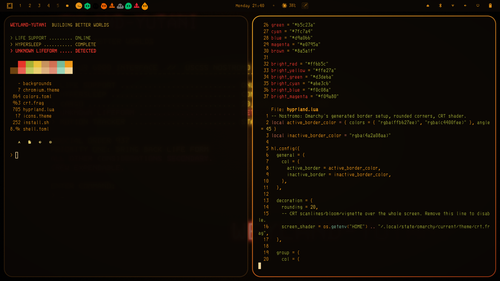

# Nostromo

An amber CRT terminal theme for [Omarchy](https://omarchy.org/), inspired by the
Weyland-Yutani hardware aboard the USCSS Nostromo: warm black, amber phosphor
text, red for alerts, rounded windows, and full-screen scanlines.



## What's in it

| File | What it does |
|---|---|
| `colors.toml` | Palette. Amber text on warm black, Weyland-Yutani red for alerts. Omarchy generates terminal, btop, bar and other app themes from it. |
| `hyprland.lua` | Amber-to-burnt-orange window border, 20px rounded corners, and the CRT shader. |
| `crt.frag` | Full-screen Hyprland shader: scanlines, soft phosphor bloom, vignette. |
| `shell.toml` | Bar and popup styling, with the bar font base size at 14. |
| `chromium.theme` | Warm-black frame color for Chromium, Chrome, Edge and Brave. |
| `icons.theme` | `Yaru-yellow-dark` icon theme. |
| `backgrounds/` | A generated amber MU-TH-UR terminal wallpaper. |
| `fonts/` | 3270 Nerd Font Mono, an IBM 3270 terminal face with Nerd Font icons. |

## Install

Requires Omarchy with Hyprland 0.55+ (Lua config) and `fc-cache` (fontconfig).

```bash
git clone https://github.com/colorlesspilgrimage/nostromo.git
cd nostromo
./install.sh
```

The script:

1. copies the theme to `~/.config/omarchy/themes/nostromo/`,
2. copies the font to `~/.local/share/fonts/` and refreshes the font cache,
3. runs `omarchy font set "3270 Nerd Font Mono"`,
4. runs `omarchy theme set nostromo`.

Options: `--no-font` keeps your current system font, and `--no-apply` installs
the files without switching themes.

### Don't use `omarchy theme install <url>`

Omarchy deliberately drops `*.lua` files from themes installed from a git URL,
because they run code. That removes `hyprland.lua`, so you would lose the rounded
corners and the scanline shader. `./install.sh` copies the theme as a
hand-written local theme, which Omarchy does not restrict.

## After installing

**Terminal font size.** `omarchy font set` resets terminal font sizes to 9, and
3270 reads small. The theme was tuned at 11. Set it in your terminal's config:

```bash
sed -i 's/^size = 9/size = 11/' ~/.config/alacritty/alacritty.toml
sed -i 's/^font-size = 9/font-size = 11/' ~/.config/ghostty/config
sed -i 's/\(font=3270 Nerd Font Mono:size=\)9/\111/' ~/.config/foot/foot.ini
omarchy restart terminal
```

**Bar size.** The bar text is `base-size = 14` in `shell.toml`. Edit it in the
repo, run `./install.sh --no-font`, then `omarchy restart shell`.

**Wallpaper.** Cycle backgrounds with `omarchy theme bg next`. Put your own images
in `backgrounds/` before installing, or in `~/.config/omarchy/backgrounds/nostromo/`.

## Customizing

- **Turn off the scanlines.** Remove the `screen_shader` line from `hyprland.lua`
  and reinstall. Note that the shader also appears in screenshots and recordings,
  and Hyprland cannot skip compositing for fullscreen apps while it is active.
- **Tune the CRT effect.** In `crt.frag`, `0.12` is bloom strength, `0.88` is
  scanline darkness and `0.45` is vignette strength.
- **Corner radius.** Change `rounding = 20` in `hyprland.lua`.
- **Colors.** `shell.toml` is a copy of what Omarchy generates from
  `colors.toml`, with the font size changed. If you edit colors in `colors.toml`,
  update the matching colors in `shell.toml` too, or delete `shell.toml` to let
  Omarchy generate it.

After any edit, run `./install.sh --no-font` to re-apply.

## Uninstall

```bash
omarchy theme set <another-theme>
rm -rf ~/.config/omarchy/themes/nostromo
rm ~/.local/share/fonts/3270NerdFontMono-Regular.ttf && fc-cache -f
omarchy font set <your-previous-font>
```

## Credits and licenses

- **Font:** [3270 Nerd Font Mono](https://github.com/ryanoasis/nerd-fonts), the
  [3270font](https://github.com/rbanffy/3270font) patched by Nerd Fonts. Its license is in
  `fonts/LICENSE-3270.txt`.
- **Theme files, shader, wallpaper and installer:** MIT, see `LICENSE`. The bundled font is
  not covered by it and keeps its own license.
- Weyland-Yutani, Nostromo and MU-TH-UR belong to their respective owners (the
  *Alien* franchise). This is a fan theme and is not affiliated with them.
